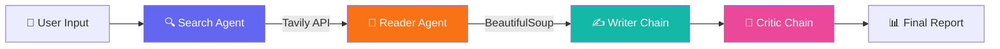

<div align="center">

# 🧭 Multi-Agent Research Studio

**An AI-powered research pipeline that searches, reads, writes, and critiques — so you don't have to.**

[](https://python.org)
[](https://streamlit.io)
[](https://langchain.com)
[](https://groq.com)
[](LICENSE)

<br>

*Enter a topic → Four AI agents collaborate → Get a polished research report in seconds.*

</div>

---

## ✨ What It Does

Multi-Agent Research Studio orchestrates **four specialized AI agents** in a sequential pipeline to produce comprehensive research reports from a single topic query:

```
🔍 Search Agent  →  📄 Reader Agent  →  ✍️ Writer Chain  →  🧐 Critic Chain
```

| Agent | Model | Role |
|-------|-------|------|
| **Search Agent** | LLaMA 3.3 70B | Queries the web via Tavily API to find reliable, recent sources |
| **Reader Agent** | LLaMA 3.3 70B | Scrapes the most relevant URL for in-depth content |
| **Writer Chain** | LLaMA 3.1 8B | Synthesizes findings into a structured research report |
| **Critic Chain** | LLaMA 3.1 8B | Reviews the draft for accuracy, quality, and completeness |

> **Two-tier model strategy:** Tool-calling agents use the 70B model for accuracy; text-only chains use the faster 8B model to save tokens.

---

## 🖥️ Screenshots

### Dark-Themed Dashboard
The UI features a premium dark interface with animated loading states, gradient accents, and a clean centered layout — no sidebar clutter.

### Loading Animation
While agents work, an orbiting particle animation with a live elapsed timer keeps you informed.

### Structured Results
Results are presented in a tabbed layout with metrics, downloadable reports, critic feedback, raw search data, and execution logs.

---

## 🏗️ Architecture



### Project Structure

```
Multi-Agent-Research-Studio/
├── app.py              # Streamlit UI — dark theme, animations, no sidebar
├── pipeline.py         # Orchestrator — runs all 4 agents sequentially
├── agents.py           # Agent/chain definitions (LLM config, prompts)
├── tools.py            # Web search (Tavily) + URL scraper (BeautifulSoup)
├── requirements.txt    # Python dependencies
├── .env                # API keys (not tracked by git)
└── .gitignore
```

---

## 🚀 Quick Start

### Prerequisites

- **Python 3.10+**
- [Groq API Key](https://console.groq.com/keys) (free tier available)
- [Tavily API Key](https://tavily.com) (free tier: 1000 searches/month)

### 1. Clone the repo

```bash
git clone https://github.com/CodewithIrtaza/MULTI_AGENT_SYSTEM.git
cd MULTI_AGENT_SYSTEM
```

### 2. Create a virtual environment

```bash
python -m venv venv

# Windows
venv\Scripts\activate

# macOS/Linux
source venv/bin/activate
```

### 3. Install dependencies

```bash
pip install -r requirements.txt
```

### 4. Set up environment variables

Create a `.env` file in the project root:

```env
GROQ_API_KEY=your_groq_api_key_here
TAVILY_API_KEY=your_tavily_api_key_here
```

### 5. Run the app

```bash
streamlit run app.py
```

The app will open at `http://localhost:8501`.

---

## ⚙️ Configuration

### Model Settings

Edit `agents.py` to change models or parameters:

```python
# For tool-calling agents (Search, Reader)
llm_tools = ChatGroq(
    model="llama-3.3-70b-versatile",
    temperature=0.3,
    max_retries=2,
    request_timeout=30,
)

# For text chains (Writer, Critic)
llm_text = ChatGroq(
    model="llama-3.1-8b-instant",
    temperature=0.3,
    max_retries=2,
    request_timeout=30,
)
```

### Pipeline Timeout

The UI enforces a **3-minute hard timeout** to prevent indefinite hangs. Adjust in `app.py`:

```python
TIMEOUT_SECONDS = 180  # change this value
```

---

## 🛠️ Tech Stack

| Technology | Purpose |
|-----------|---------|
| **Streamlit** | Web UI framework |
| **LangChain** | Agent orchestration & prompt chains |
| **LangGraph** | Agent runtime with tool-calling |
| **Groq** | Ultra-fast LLM inference (LLaMA 3.3) |
| **Tavily** | Web search API |
| **BeautifulSoup** | HTML parsing & web scraping |
| **Python-dotenv** | Environment variable management |

---

## 📝 How the Pipeline Works

1. **Search Agent** calls the Tavily API with a refined query, returning the top 5 results with titles, URLs, and snippets.

2. **Reader Agent** picks the most relevant URL from search results and scrapes it using BeautifulSoup, extracting up to 5,000 characters of clean text.

3. **Writer Chain** receives both search results and scraped content, then generates a structured report with Introduction, Key Findings, Conclusion, and Sources.

4. **Critic Chain** reviews the draft and scores it on a 1–10 scale, listing strengths, areas to improve, and a one-line verdict.

All stages include **automatic retry with backoff** for Groq rate limits.

---

## 🤝 Contributing

Contributions are welcome! Feel free to:

1. Fork the repository
2. Create a feature branch (`git checkout -b feature/amazing-feature`)
3. Commit your changes (`git commit -m 'Add amazing feature'`)
4. Push to the branch (`git push origin feature/amazing-feature`)
5. Open a Pull Request

---

## 📄 License

This project is open source and available under the [MIT License](LICENSE).

---

## 👤 Author

**Irtaza** — [@CodewithIrtaza](https://github.com/CodewithIrtaza)

---

<div align="center">

**⭐ Star this repo if you found it useful!**

</div>
